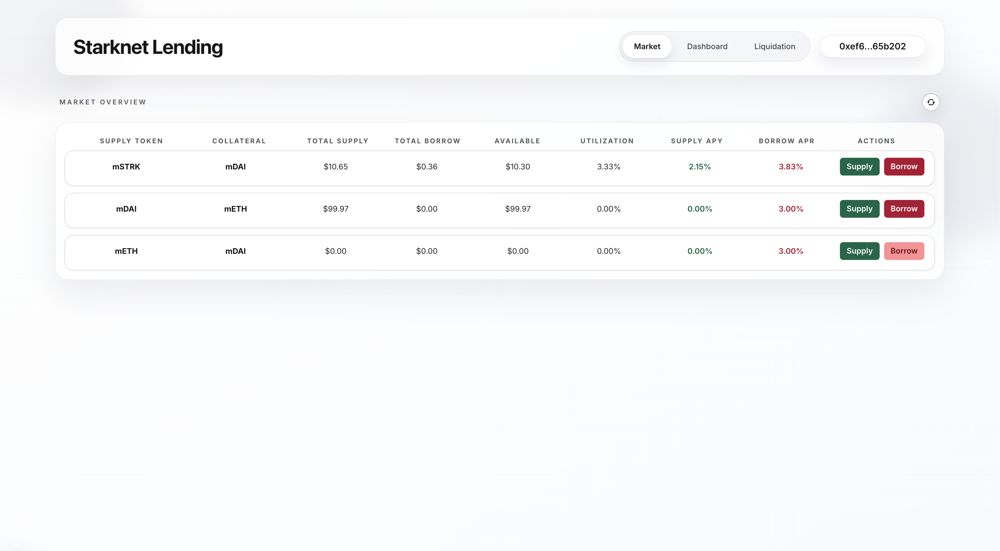
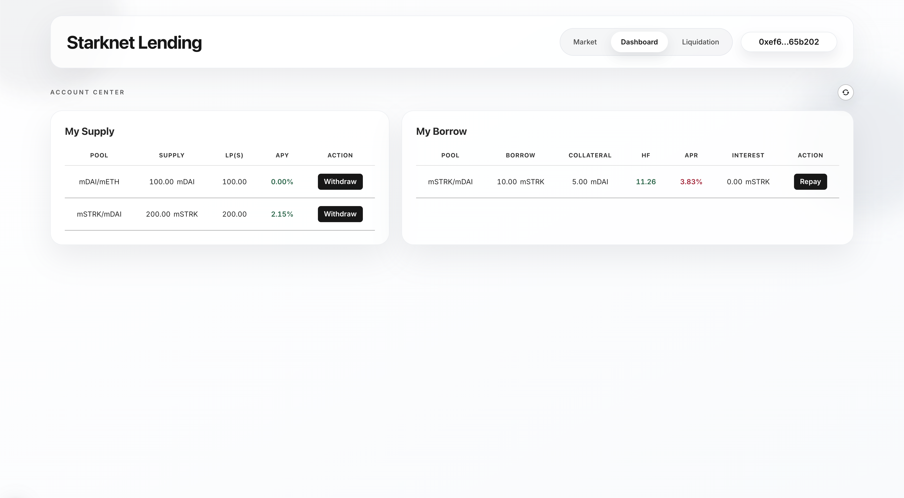

<h1 align="center">Starknet Lending Frontend</h1>

<p align="center">
  <a href="https://github.com/hieutrinh02/starknet-lending-fe/blob/main/LICENSE">
    
  </a>
  
  
  
</p>

<p align="center">
  
</p>

<p align="center">
  
</p>

## ✨ Overview

This repository contains a Next.js frontend for interacting with the [`starknet-lending-sc`](https://github.com/hieutrinh02/starknet-lending-sc). It is intended to be used together with the indexer at [`starknet-lending-indexer`](https://github.com/hieutrinh02/starknet-lending-indexer).

Its scope is intentionally focused:

- read pool registry data through the local indexer
- connect to Starknet wallet
- fetch pool, user, and price data from Starknet contracts
- support five user actions:
  - supply
  - borrow
  - withdraw
  - repay
  - liquidate

## 📄 High-level Design

The frontend follows a simple split:

1. Read pool registry data from the local indexer
2. Resolve token metadata and prices from on-chain contracts
3. Build Starknet transactions directly against the deployed market contract
4. Ask the connected wallet to sign and submit transaction

Pages:

- `/market`
- `/dashboard`
- `/liquidation`

## 🛠 Run Locally

From within the frontend folder:

Install dependencies:

```bash
yarn
```

Copy `.env.example` to `.env` and configure:

```env
NEXT_PUBLIC_INDEXER_URL=http://127.0.0.1:8787
NEXT_PUBLIC_RPC_URL=REPLACE_WITH_RPC_URL
NEXT_PUBLIC_CHAIN_ID=SN_SEPOLIA
NEXT_PUBLIC_MARKET_CONTRACT=REPLACE_WITH_MARKET_ADDRESS
```

Run in development mode:

```bash
yarn dev
```

The app expects the local indexer to already be running.

## ⚠️ Disclaimer

This code is for educational purposes only, has not been audited, and is provided without any warranties or guarantees.

## 📜 License

This project is licensed under the MIT License.
